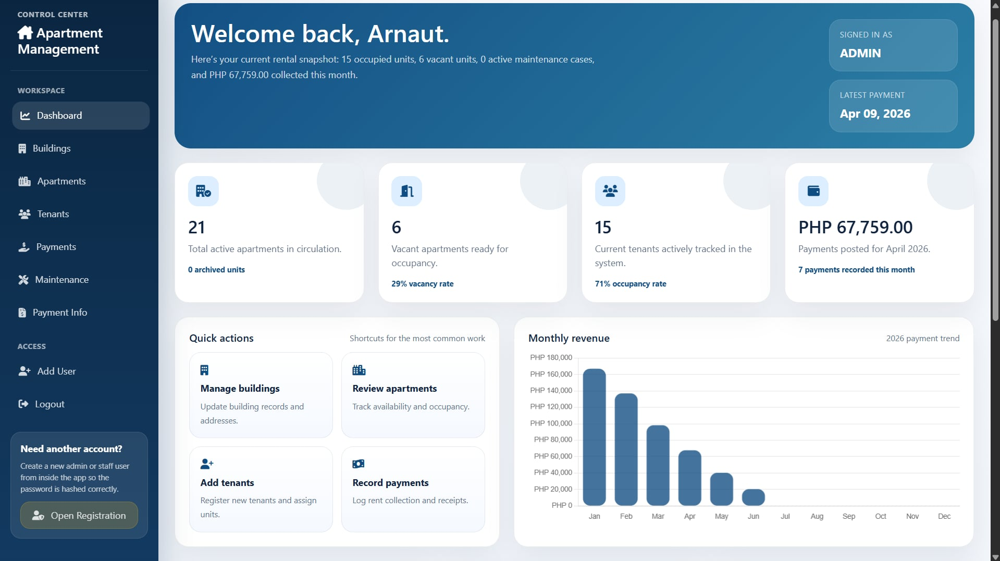
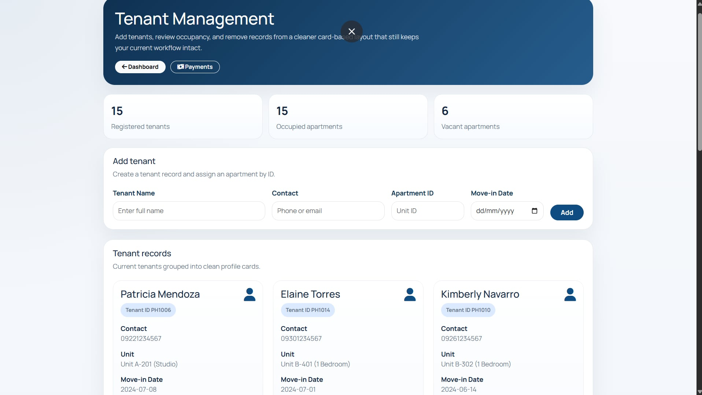
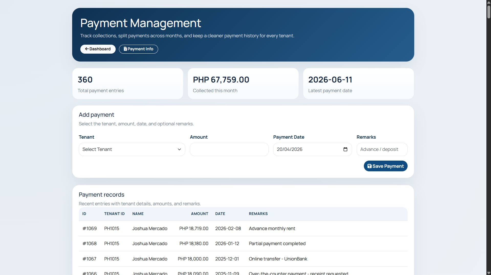
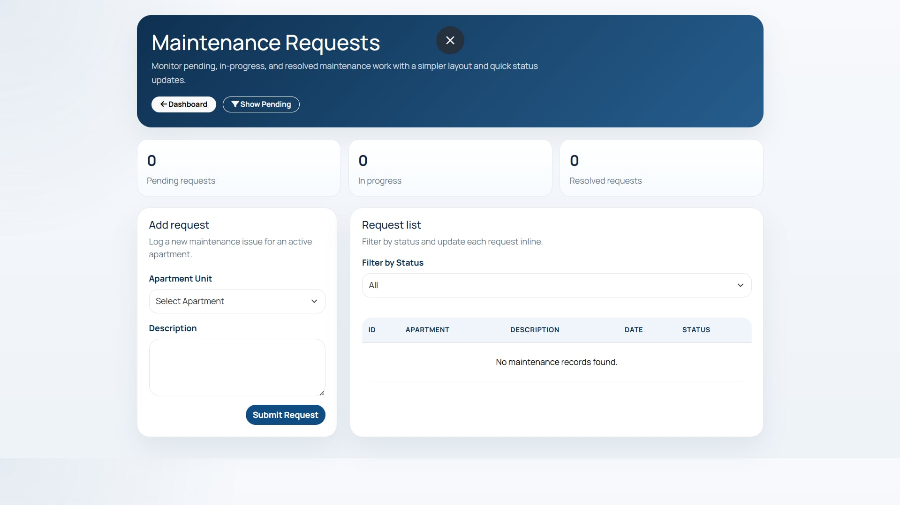
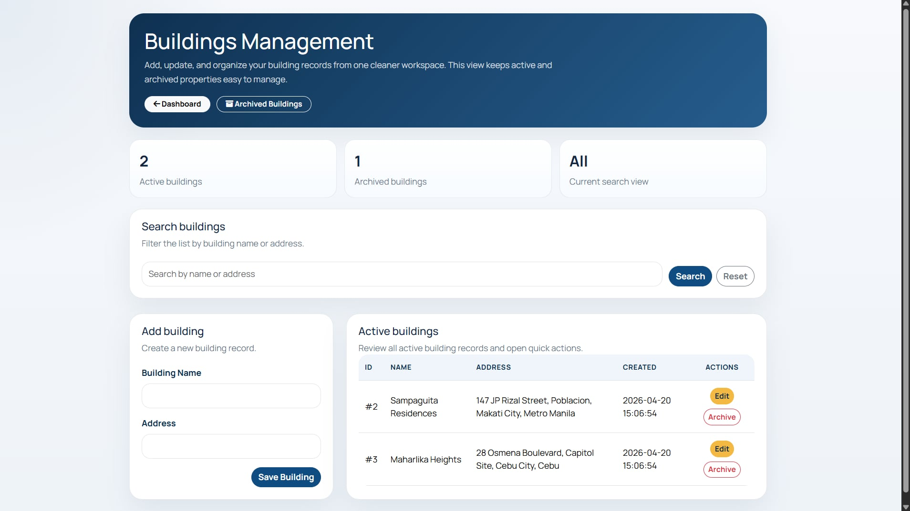

# Apartment Management System

## Overview
A web-based Apartment Management System built with PHP and MySQL featuring tenant tracking, payments, maintenance management, and email notifications.

## Features
- User authentication (Admin/Staff)
- Apartment and building management
- Tenant tracking
- Payment monitoring
- Maintenance system
- Receipt generation
- Email notification system (PHPMailer)
- Dashboard analytics

## Technologies Used
- PHP
- MySQL
- CSS
- XAMPP
- PHPMailer (Composer)

## Screenshots

## Installation

1. Move the project to XAMPP `htdocs`
2. Open phpMyAdmin
3. Create a database (e.g. `apartment_system`)
4. Import `apartment_mgmt.sql`
5. Start Apache and MySQL
6. Open:
   http://localhost/apartment-management-system

## Email Configuration
Update your SMTP credentials in the mailer file before using:
- Email
- App password

## Author
Arnaut Alfonso
